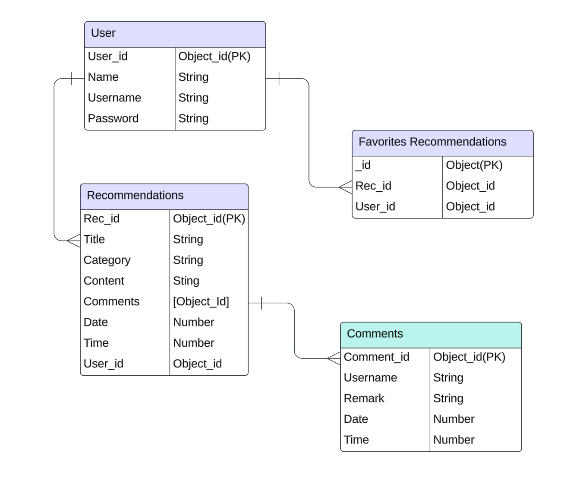
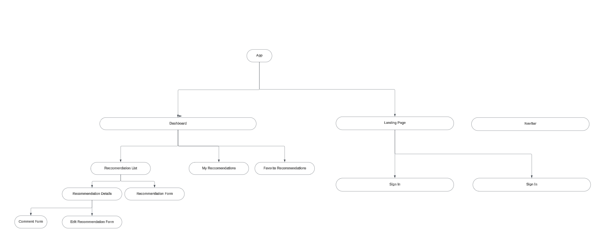

 # RECiT 

## Description
RECiT is a social recommendation app designed for users to discover and share suggestions on anything they believe others might find valuable or interesting. Whether it's books, movies, restaurants, products, or experiences, RECiT provides an engaging space for users to exchange their favorite recommendations seamlessly.

## Key Features

Create, Update, and Manage Recommendations (Recs): Users can easily create, edit, or delete their own recommendations, ensuring their insights remain fresh and relevant.

Curate Personal Favorites: Users can add others’ Recs to their favorites, creating a personalized list of recommendations tailored to their interests.

## Value Proposition
RECiT simplifies the process of finding trusted recommendations while encouraging meaningful connections and engagement between users. By allowing individuals to share their insights and favorite discoveries, the app creates a vibrant ecosystem of knowledge and inspiration.

## Interact Here

### Landing Page

### Sign Up 

### Sign In

### Welcome Page

### Recommendations

### Favorites

### My Recommendations

### Create A Recommendation

### Single Recommendation

## Deployed Website
- Deployed Website: https://recit-app.netlify.app/

## GitHub Repos
- BackEnd: https://github.com/viededario/RECiT-Backend
- FrontEnd: https://github.com/viededario/RECiT-Frontend

## ERD Diagram

## Component Diagram

## Routes

### Sign-up

| Action  | Route       | HTTP Verb |
|---------|-------------|-----------|
| Index   | `/sign-up`  | GET       |
| Create  | `/sign-up`  | POST      |

### Sign-in

| Action  | Route           | HTTP Verb |
|---------|-----------------|-----------|
| Index   | `/user/sign-in` | GET       |
| Create  | `/user/sign-in` | POST      |

### My Recommendations

| Action | Route                                   | HTTP Verb |
|--------|----------------------------------------|-----------|
| Index  | `/user/recommendations`                 | GET       |
| Show   | `/user/recommendations/:recommendationId` | GET       |

### My Favorites

| Action | Route                          | HTTP Verb |
|--------|--------------------------------|-----------|
| Index  | `/user/favorites`              | GET       |
| Show   | `/user/favorites/:favoritesId` | GET       |

### Recommendations

| Action  | Route                                   | HTTP Verb |
|---------|----------------------------------------|-----------|
| Index   | `/recommendations`                     | GET       |
| Create  | `/recommendations`                     | POST      |
| Show    | `/recommendations/:recommendationId`   | GET       |
| Edit    | `/recommendations/:recommendationId`   | GET       |
| Update  | `/recommendations/:recommendationId`   | PUT       |
| Delete  | `/recommendations/:recommendationId`   | DELETE    |

### Comments

| Action | Route                                                   | HTTP Verb |
|--------|--------------------------------------------------------|-----------|
| Create | `/recommendations/:recommendationId/comments`          | POST      |
| Delete | `/recommendations/:recommendationId/comments/:commentId` | DELETE    |

## Resources

- Stack Overflow, ChatGPT, GA lectures, GA labs, and Google. 